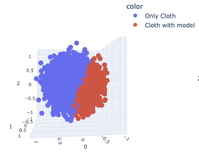
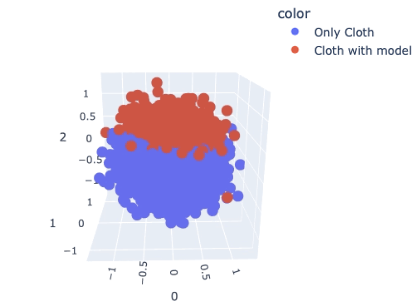
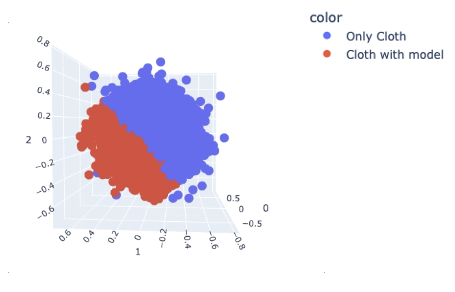
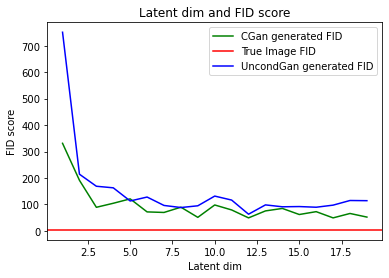
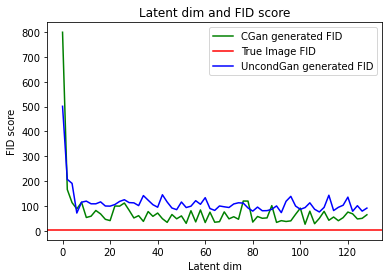

# GAN and CGAN latent vis
---
In this project, I examine the relationship between the dimensionality of the random latent vector used to generate images with a Conditional Generative Adversarial Network (CGAN) and the quality of the generated images, as measured by the Fréchet Inception Distance (FID) score. The results show that increasing the dimensionality of the latent vector leads to the generation of higher-quality images, but that there may be an optimal point beyond which further increases have little effect. My findings suggest that the FID score can be a useful measure of the quality of images generated by a CGAN and that the dimensionality of the latent vector plays a role in determining this quality. And this can be a metric to evaluate information contained in the dataset.

### Use following code to download Cloth & Model dataset.

``` {python}
!kaggle datasets download -d dqmonn/zalando-store-crawl -p datasets
!unzip datasets/zalando-store-crawl.zip -d datasets/
```

## Experiment 1 (Cloth & Model)

#### Data 

The Clothing Models dataset on Kaggle is a collection of images of clothing and models wearing the clothing. The dataset consists of 16.2k images and most of them are cloth with models. To fit the data for binary CGAN, I manually labeled data into two groups, only cloth, and cloth with models. Since the data set is highly imbalanced, I end up with 1870 images in each group.

#### Setup
Since the limited computation power and for visualization perpuse, I only trained three GAN model with input dim of 3, first GAN is unconditional GAN model and 3 dimensional input is pure random noise sampled form normal distribution. Second GAN model is a conditional GAN model, the first and second dimension of input is the same random noise sampled form normal distribution and the third dimension is binary label. The third GAN is also an conditional GAN but only the first dimension of input is random noise, the second and the third dimension is softmax label.
After trained these three GAN model, FID score between true images and generated images are then calculated for further analysis.

#### Visualization



#### Result

|          | UGAN | CGAN_2 | CGAN_1 | True_Images |
|----------|---------|---------|---------|---------|
| UGAN     | 0       | 223.725 | 158.855  | 2283.79  |
| CGAN_2   | 223.725 | 0       | 468.738  | 2077.349 |
| CGAN_1   | 158.855 | 468.738 | 0        | 2489.150 |
|True_Images| 2283.79| 2077.349| 2489.150 | 0        |
- FID scores for cloth & model GANs. UGAN is the unconditional GAN, CGAN_2 is the CGAN with two dimensional noise, CGAN_1 is the CGAN with only one dimensional noise.

## Experiment 2 (MNIST)

#### Data
The MNIST dataset is a collection of 70,000 28x28 pixel grayscale images of handwritten digits from 0 to 9, along with their corresponding labels. It is commonly used as a benchmark for evaluating machine learning models, particularly in the field of image classification. The MNIST dataset has also been used for tasks such as object recognition, image generation, and anomaly detection.

#### Setup
MNIST provides a balanced dataset with 70000 samples and is much easier to train compared with Cloth and model data. I trained 64 CGAN models whose inputs are fixed 10-dimensional softmax label information concatenated with random noise vectors sampled from standard normal distribution whose dimensions vary from 0 to 128. And then FID score is calculated for each of the 64 GANs.

#### Result
. 
- FID scores for 64 CGANs and 64 UGANs trained on MNIST with different latent dimension, The red line in the plot shows the average FID score between different batchs of true images.  
  
- Dimension of latent vectors from 0 to 20 increased by 1.

#### Conclusion

- From above experiment we found that except for 10 label, the rest of the information in MNIST dataset can be fully represented by a span of 8 basis vectors. 
- Compared with UGAN, FID scores of CGAN begins to stable at 3, UGAN begins to satble at around 7, which means 4 degree of freedom is enough to represent 10 dim softmax labels.

## Future work
- Need to run more experiments, and choose the optimal point in a more theoretical way.
- FID is probably not a good method
- Provide theoretical provement.

